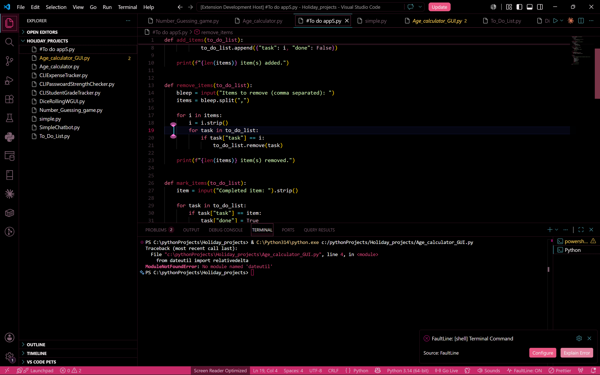
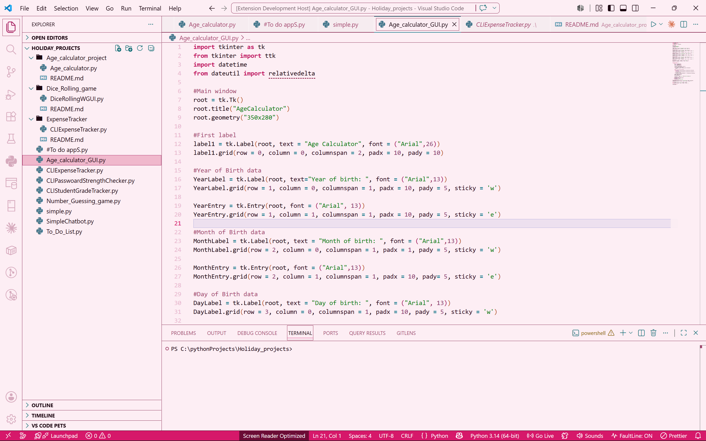

# Dark Midnight Pink 

A high-contrast, distraction-free workspace aesthetic built for Visual Studio Code. Featuring a striking blend of deep midnight bases, vibrant cyber pink accents, and high-readability structural highlights, this extension package now includes both **Dark** and **Light** variants for seamless workflow flexibility.

---

## Theme Previews

### Midnight Cyberpunk (Dark)


### Midnight Pink (Light Variant)


---

## Package Highlights & Themes

This extension package provides two distinct color themes tailored for day-and-night programming sessions:

### 1. Midnight Cyberpunk (Dark)
* **Pitch-Black Base (`#000000`):** Maximizes panel performance and minimizes eye strain during late-night coding sessions.
* **Vivid Cyber Pink (`#b81858`) & Electric Cyan (`#4edbec`):** Drives immediate visual triage for active focus states, syntax highlights, and Git diagnostics.
* **Deep Plum Structural Architecture (`#471a2c`):** Replaces generic grey panel borders with clean, cohesive visual separation.

### 2. Midnight Pink (Light Variant)
* **Soft Light Canvas:** A clean, radiant backdrop designed to maintain high readability and low fatigue under bright ambient room lighting.
* **Adapted Magenta & Rose Accents:** Reimagines signature pink and plum accents into crisp, high-contrast dark tones against a bright editor canvas.
* **Unified UI Flow:** Maintains the exact structural hierarchy and file status indicators as the dark variant for consistent context switching.

---

## Activation & Quick Start

1. Install **Dark Midnight Pink Two** directly from the [VS Code Marketplace](https://marketplace.visualstudio.com/).
2. Open your Theme Preferences via **File > Preferences > Theme > Color Theme** (or press `Ctrl+K Ctrl+T` / `Cmd+K Cmd+T`).
3. Choose your preferred variant from the dropdown list:
   * **`Midnight Cyberpunk (Two)`** *(Dark)*
   * **`Midnight Pink Light`** *(Light)*

> **Tip:** To automatically switch between the dark and light variants based on your OS settings, add the following to your `settings.json`:
>
> ```json
> "window.autoDetectColorScheme": true,
> "workbench.preferredDarkColorTheme": "Midnight Cyberpunk (Two)",
> "workbench.preferredLightColorTheme": "Midnight Pink Light"
> ```

---

##  Customization Overrides

You can further refine specific UI contrast levels locally by overriding key attributes in your `settings.json` file:

```json
"workbench.colorCustomizations": {
  "[Midnight Cyberpunk (Two)]": {
    "editor.background": "#000000",
    "statusBar.background": "#000000"
  },
  "[Midnight Pink Light]": {
    "editor.background": "#fdeef4",
    "statusBar.background": "#f6ecf0"
  }
}